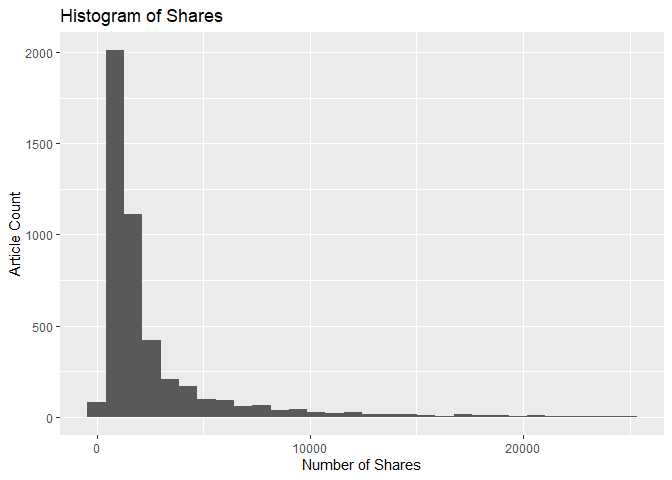
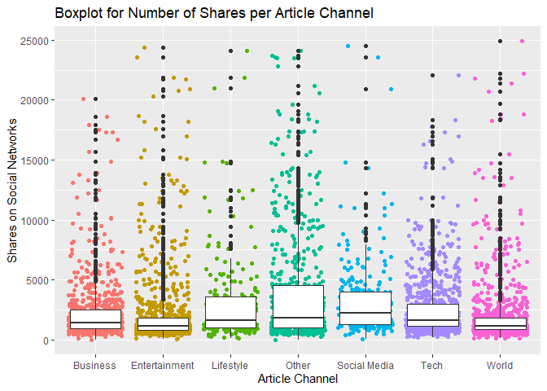
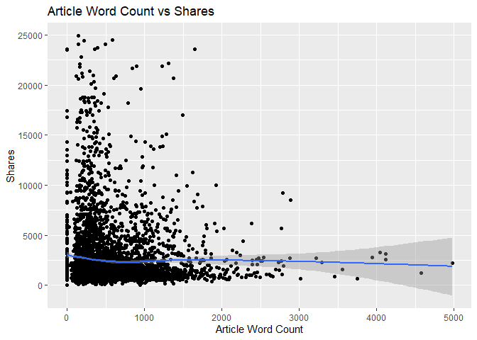
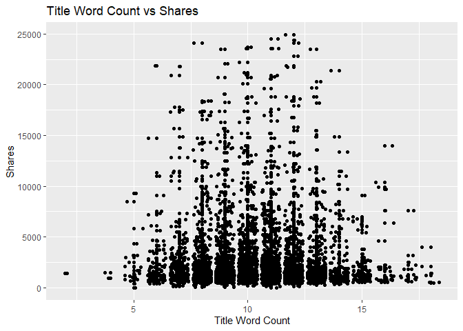

Project 2
================
Brian Sugg
7/3/2020

  - [Introduction](#introduction)
      - [Purpose](#purpose)
      - [Data Description](#data-description)
      - [\*\*\*\*\*Methods](#methods)
  - [Data](#data)
      - [Metadata](#metadata)
      - [Import](#import)
      - [Slicing](#slicing)
  - [Summarizations](#summarizations)
      - [Numeric Summaries](#numeric-summaries)
      - [Visuals](#visuals)
  - [\*\*\*\*\*\*\*\*\*\*\*\*\*\*\*\*\*\*\*\*\*\*\*\*\*Modeling](#modeling)
      - [\*\*\*\*\*\*\*\*\*\*Ensemble Model](#ensemble-model)
          - [Fit](#fit)
          - [Selection](#selection)
          - [Test Set Predictions](#test-set-predictions)
      - [\*\*\*\*\*\*\*\*\*\*Linear Regression
        Model](#linear-regression-model)
          - [Fit](#fit-1)
          - [Selection](#selection-1)
          - [Test Set Predictions](#test-set-predictions-1)
  - [\*\*\*\*\*\*\*\*\*\*\*\*\*\*\*\*\*\*\*\*\*\*\*\*\*Automation](#automation)
  - [\*\*\*\*\*\*\*\*\*\*\*\*\*\*\*\*\*\*\*\*\*\*\*\*\*Conclusion](#conclusion)

# Introduction

## Purpose

The overall theme of this exercise is determining the popularity of
online news. The goal is to create models for predicting the number of
times a news article from *mashable.com* will be shared in social
networks. Two models will be created: a linear regression model and a
non-linear model. The parameter functionality of markdown will be used
to automatically generate an analysis report for each day of the week
that an article might be published.

## Data Description

The data comes from the *UC Irvine Machine Learning Repository* and can
be found in its original form at this
[link](https://archive.ics.uci.edu/ml/datasets/Online+News+Popularity#).

This data set covers a two year period, listing all published articles
from Mashable and several variables of associated characteristics, such
as:

  - Published Day of Week
  - Channel, or Genre (Lifestyle, Business, World, Entertainment, etc.)
  - Word Count
  - Number of Images
  - *…and several others…*

In total there are **58 possible predictive attributes** with the goal
of predicting the **response variable of number of shares in social
networks**. The provided link above goes into more detail for all
variables and their representation.

## \*\*\*\*\*Methods

**To be filled in later** \>\> The methods you’ll use (roughly - more
detail can be given later in the document).

# Data

## Metadata

As mentioned previously, the original data set contains 58 possible
predictor variables and 1 response variable. We will add 1 additional
response variable for “Popularity” during the import process below in
case this is something we wish to also predict. *Popularity* will be
defined as any article that is shared at least 1,400 times.

The provided predictor variables have a wide range of characteristics
they represent. A listing of some of the primary variables this analysis
will focus on, including the thought process behind their selection:

  - `n_tokens_title` - number of words in the title
      - Are short titles more catchy to the reader?  
  - `n_tokens_content` - number of words in the article
      - Is a shorter article more likely to be quickly digested and
        shared vs longer articles that require more time?  
  - `num_imgs` - number of images in the article
      - Are more images more visually appealing, generating shares from
        people wanting to share the images within?  
  - `num_videos` - number of videos in the article
      - Videos can provide article content more easily, but also
        requires the attention of the viewer. Could this influence
        sharing?  
  - `data_channel_is_*` - 6 binary variables that indicate if an article
    falls under the genre *Lifestyle*, *Entertainment*, *Business*,
    *Social Media*, *Tech*, or *World*
      - Does the channel/genre influence sharing?

Many other variables are present, especially in determining the
positive/negative association of words within the article and the title,
which will be discussed further if they become prevalent in our
analysis.

## Import

The raw data set from UCI is provided and read in as a `.csv` file,
creating the `news` data set. Extreme values for `shares` \> 25,000 are
filtered out (578 removed out of 39,644 records). The parameter
functionality of markdown is then incorporated from the YAML header,
initially using the parameter value `day` to filter the `news` data set
on a certain day of week for analysis.

Additional modifications are made, including the creation of a binary
`popularity` variable as mentioned earlier, defining popularity as any
article shared more than 1,400 times. To help visualize the amount of
articles per `channel`, this variable is created as well using the
`data_channel_is*` variables. Finally, any non-predictive variables are
removed to create a `newsSlice` data set that will be sliced into train
and test sets later on.

``` r
# Read in the data, filter out extreme values
news <- read_csv("data/OnlineNewsPopularity.csv")
```

    ## Parsed with column specification:
    ## cols(
    ##   .default = col_double(),
    ##   url = col_character()
    ## )

    ## See spec(...) for full column specifications.

``` r
news <- news %>% filter(shares < 25000)
# Filter data set on day of week using markdown parameter
filterDay <- paste0("weekday_is_", tolower(params$day))
news <- filter(news, eval(as.symbol(filterDay)) == 1)
# Create a binary variable for popularity
news$sharesPopular <- factor(ifelse(news$shares < 1400, 0, 1))
# Create variable for channel using the 6 individual channel variables
# if present
news$channel <- factor(ifelse(news$data_channel_is_lifestyle == 1, "Lifestyle", 
    ifelse(news$data_channel_is_entertainment == 1, "Entertainment", ifelse(news$data_channel_is_bus == 
        1, "Business", ifelse(news$data_channel_is_socmed == 1, "Social Media", 
        ifelse(news$data_channel_is_tech == 1, "Tech", ifelse(news$data_channel_is_world == 
            1, "World", "Other")))))))
# Remove 2 non-predictive variables as noted in linked documentation
# from UCI
newsSlice <- news %>% select(-url, -timedelta)
```

For verification, a preview of the `newsSlice` set is generated prior to
slicing:

``` r
head(newsSlice)
```

    ## # A tibble: 6 x 61
    ##   n_tokens_title n_tokens_content n_unique_tokens n_non_stop_words
    ##            <dbl>            <dbl>           <dbl>            <dbl>
    ## 1             12              149           0.728             1.00
    ## 2             11              605           0.477             1.00
    ## 3             11              589           0.525             1.00
    ## 4             12              221           0.660             1.00
    ## 5             12              552           0.525             1.00
    ## 6             12              141           0.777             1.00
    ## # ... with 57 more variables: n_non_stop_unique_tokens <dbl>, num_hrefs <dbl>,
    ## #   num_self_hrefs <dbl>, num_imgs <dbl>, num_videos <dbl>,
    ## #   average_token_length <dbl>, num_keywords <dbl>,
    ## #   data_channel_is_lifestyle <dbl>, data_channel_is_entertainment <dbl>,
    ## #   data_channel_is_bus <dbl>, data_channel_is_socmed <dbl>,
    ## #   data_channel_is_tech <dbl>, data_channel_is_world <dbl>, kw_min_min <dbl>,
    ## #   kw_max_min <dbl>, kw_avg_min <dbl>, kw_min_max <dbl>, kw_max_max <dbl>,
    ## #   kw_avg_max <dbl>, kw_min_avg <dbl>, kw_max_avg <dbl>, kw_avg_avg <dbl>,
    ## #   self_reference_min_shares <dbl>, self_reference_max_shares <dbl>,
    ## #   self_reference_avg_sharess <dbl>, weekday_is_monday <dbl>,
    ## #   weekday_is_tuesday <dbl>, weekday_is_wednesday <dbl>,
    ## #   weekday_is_thursday <dbl>, weekday_is_friday <dbl>,
    ## #   weekday_is_saturday <dbl>, weekday_is_sunday <dbl>, is_weekend <dbl>,
    ## #   LDA_00 <dbl>, LDA_01 <dbl>, LDA_02 <dbl>, LDA_03 <dbl>, LDA_04 <dbl>,
    ## #   global_subjectivity <dbl>, global_sentiment_polarity <dbl>,
    ## #   global_rate_positive_words <dbl>, global_rate_negative_words <dbl>,
    ## #   rate_positive_words <dbl>, rate_negative_words <dbl>,
    ## #   avg_positive_polarity <dbl>, min_positive_polarity <dbl>,
    ## #   max_positive_polarity <dbl>, avg_negative_polarity <dbl>,
    ## #   min_negative_polarity <dbl>, max_negative_polarity <dbl>,
    ## #   title_subjectivity <dbl>, title_sentiment_polarity <dbl>,
    ## #   abs_title_subjectivity <dbl>, abs_title_sentiment_polarity <dbl>,
    ## #   shares <dbl>, sharesPopular <fct>, channel <fct>

## Slicing

Utilizing the newly created `newsSlice` data set, a random sample is
performed for 70% of the data to make up the training set `newsTrain`,
and the remaining 30% to be used later as the test set `newsTest`. A
seed is set beforehand to ensure reproducible sampling in the future if
needed.

``` r
# Set seed for reproducible results
set.seed(1)
# Create the train and test sets
train <- sample(1:nrow(newsSlice), size = nrow(newsSlice) * 0.7)
test <- dplyr::setdiff(1:nrow(newsSlice), train)
newsTrain <- newsSlice[train, ]
newsTest <- newsSlice[test, ]
```

For the analysis of articles published on **Monday** there are a total
of 6,547 records sliced as:

  - 4,582 records used in the `newsTrain` data set (69.99%)  
  - 1,965 records used in the `newsTest` data set (30.01%)

# Summarizations

Some basic summary statistics and visualizations of the `newsTrain`
training data are provided in the below sections, using variables
discussed previously.

## Numeric Summaries

A contingecy table is provided for the categorical variable `channel` to
compare against article popularity, where a popular article is defined
as having at least 1,400 shares.

``` r
# Contingency tables of frequency
knitr::kable(table(newsTrain$channel, newsTrain$sharesPopular), format = "html", 
    caption = "Frequency of Article Channel by Sharing Popularity (0=NotPopular,1=Popular)")
```

<table>

<caption>

Frequency of Article Channel by Sharing Popularity
(0=NotPopular,1=Popular)

</caption>

<thead>

<tr>

<th style="text-align:left;">

</th>

<th style="text-align:right;">

0

</th>

<th style="text-align:right;">

1

</th>

</tr>

</thead>

<tbody>

<tr>

<td style="text-align:left;">

Business

</td>

<td style="text-align:right;">

401

</td>

<td style="text-align:right;">

418

</td>

</tr>

<tr>

<td style="text-align:left;">

Entertainment

</td>

<td style="text-align:right;">

577

</td>

<td style="text-align:right;">

333

</td>

</tr>

<tr>

<td style="text-align:left;">

Lifestyle

</td>

<td style="text-align:right;">

93

</td>

<td style="text-align:right;">

130

</td>

</tr>

<tr>

<td style="text-align:left;">

Other

</td>

<td style="text-align:right;">

227

</td>

<td style="text-align:right;">

366

</td>

</tr>

<tr>

<td style="text-align:left;">

Social Media

</td>

<td style="text-align:right;">

64

</td>

<td style="text-align:right;">

173

</td>

</tr>

<tr>

<td style="text-align:left;">

Tech

</td>

<td style="text-align:right;">

333

</td>

<td style="text-align:right;">

505

</td>

</tr>

<tr>

<td style="text-align:left;">

World

</td>

<td style="text-align:right;">

601

</td>

<td style="text-align:right;">

361

</td>

</tr>

</tbody>

</table>

Numeric summaries of different article stats help reveal a few
observations from the training data set regarding the length of article
titles, the length of articles, the number of images within an article,
and the number of videos within an article. The correlation between
these variables and the response variable `shares` will be explored
further with visuals in the following section.

``` r
knitr::kable(cbind(`Title Word Count` = round(summary(newsTrain$n_tokens_title), 
    1), `Article Word Count` = round(summary(newsTrain$n_tokens_content), 
    1), `Number of Images` = round(summary(newsTrain$num_imgs), 1), `Number of Videos` = round(summary(newsTrain$num_videos), 
    1)), caption = paste("Summary of Article Characteristics"))
```

|         | Title Word Count | Article Word Count | Number of Images | Number of Videos |
| ------- | ---------------: | -----------------: | ---------------: | ---------------: |
| Min.    |              2.0 |                0.0 |              0.0 |              0.0 |
| 1st Qu. |              9.0 |              252.0 |              1.0 |              0.0 |
| Median  |             10.0 |              403.5 |              1.0 |              0.0 |
| Mean    |             10.4 |              548.0 |              4.5 |              1.3 |
| 3rd Qu. |             12.0 |              726.8 |              3.0 |              1.0 |
| Max.    |             18.0 |             4979.0 |             93.0 |             75.0 |

Summary of Article Characteristics

## Visuals

A basic histogram is first explored for number of shares in the
`newsTrain` data set, which is typically skewed right.

``` r
# Histogram creation
histShares <- ggplot(data = newsTrain, aes(x = shares))
histShares + geom_histogram(bins = 30) + labs(x = "Number of Shares", y = "Article Count", 
    title = "Histogram of Shares")
```

<!-- -->

The number of shares can be better visualized in a boxplot by `channel`,
showcasing the summary stats for each.

``` r
# Boxplot creation by position
boxChannel <- ggplot(data = newsTrain)
boxChannel + geom_jitter(aes(x = channel, y = shares, color = channel)) + 
    geom_boxplot(aes(x = channel, y = shares)) + labs(x = "Article Channel", 
    y = "Shares on Social Networks", title = "Boxplot for Number of Shares per Article Channel") + 
    theme(legend.position = "none")
```

<!-- -->

``` r
# Scatter plot 1 creation
plotWordCount <- ggplot(data = newsTrain, aes(x = n_tokens_content, y = shares))
plotWordCount + geom_point() + geom_smooth(method = NULL) + labs(x = "Article Word Count", 
    y = "Shares", title = "Article Word Count vs Shares")
```

    ## `geom_smooth()` using method = 'gam' and formula 'y ~ s(x, bs = "cs")'

<!-- -->

``` r
# Scatter plot 2 creation
plotImages <- ggplot(data = newsTrain, aes(x = num_imgs, y = shares))
plotImages + geom_point() + geom_smooth(method = NULL) + labs(x = "Number of Images", 
    y = "Shares", title = "Number of Images vs Shares")
```

    ## `geom_smooth()` using method = 'gam' and formula 'y ~ s(x, bs = "cs")'

<!-- -->

``` r
# Scatter plot 3 creation
plotVideos <- ggplot(data = newsTrain, aes(x = n_tokens_content, y = shares))
plotVideos + geom_point() + geom_smooth(method = NULL) + labs(x = "Number of Videos", 
    y = "Shares", title = "Number of Videos vs Shares")
```

    ## `geom_smooth()` using method = 'gam' and formula 'y ~ s(x, bs = "cs")'

<!-- -->

``` r
# Scatter plot 4 creation
plotTitle <- ggplot(data = newsTrain, aes(x = n_tokens_title, y = shares))
plotTitle + geom_point() + geom_jitter() + labs(x = "Title Word Count", 
    y = "Shares", title = "Title Word Count vs Shares")
```

<!-- -->

``` r
# 100% Stack bar chart on popularity
stackBar <- ggplot(data = newsTrain, aes(x = n_tokens_title))
stackBar + geom_bar(aes(fill = sharesPopular), position = "fill") + labs(x = "Title Word Count", 
    y = "Popularity %", title = "Popularity (0=NotPopular,1=Popular) vs Title Word Count") + 
    scale_fill_discrete(name = "Popular Article")
```

<!-- -->

A few plots help illustrate the above numeric summaries, and offer
additional views.

The general things that the plots describe should be explained but,
since we are going to automate things, there is no need to try and
explain particular trends in the plots you see (unless you want to try
and automate that too\!).

# \*\*\*\*\*\*\*\*\*\*\*\*\*\*\*\*\*\*\*\*\*\*\*\*\*Modeling

Once you have your training data set, we are ready to fit some models.
You should fit two types of models to predict the shares. One model
should be an ensemble model (bagged trees, random forests, or boosted
trees) and one should be a linear regression model (or collection of
them that you’ll choose from).

The article referenced in the UCI website mentions that they made the
problem into a binary classification problem by dividing the shares into
two groups (\< 1400 and ≥ 1400), you can do this if you’d like or simply
try to predict the shares themselves.

Feel free to use code similar to the notes or use the caret package.

## \*\*\*\*\*\*\*\*\*\*Ensemble Model

### Fit

Fit model on training data set.

### Selection

Your methodology for choosing your model during the training phase
should be explained.

### Test Set Predictions

After training/tuning your two types of models (linear and non-linear)
using cross-validation, AIC, or your preferred method (all on the
training data set only\!) you should then compare them on the test set.

Include metrics for accuracy and misclassification rate.

## \*\*\*\*\*\*\*\*\*\*Linear Regression Model

### Fit

Fit model on training data set.

### Selection

Your methodology for choosing your model during the training phase
should be explained.

### Test Set Predictions

After training/tuning your two types of models (linear and non-linear)
using cross-validation, AIC, or your preferred method (all on the
training data set only\!) you should then compare them on the test set.

Include metrics for accuracy and misclassification rate.

# \*\*\*\*\*\*\*\*\*\*\*\*\*\*\*\*\*\*\*\*\*\*\*\*\*Automation

Once you’ve completed the above for Monday, adapt the code so that you
can use a parameter in your build process that will cycle through the
weekday\_is\_\* variables.

The analysis for [Monday is available here](MondayAnalysis.md)

# \*\*\*\*\*\*\*\*\*\*\*\*\*\*\*\*\*\*\*\*\*\*\*\*\*Conclusion

No description given. Explain final model selection and evaluation of
accuracy and misclassification rate metrics.
