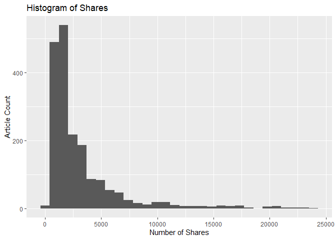
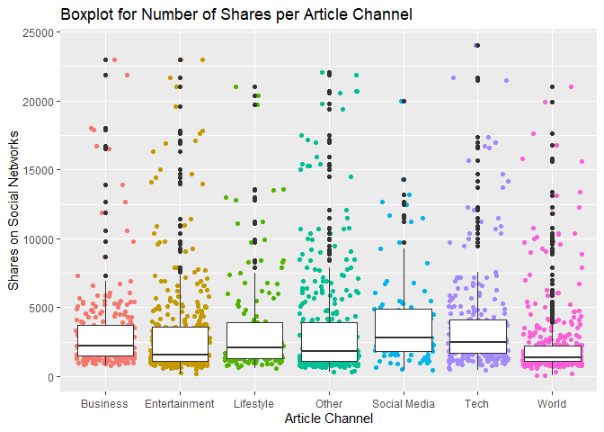
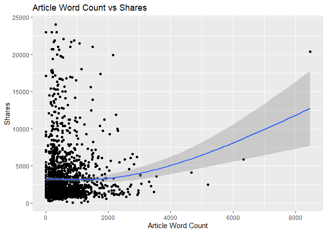
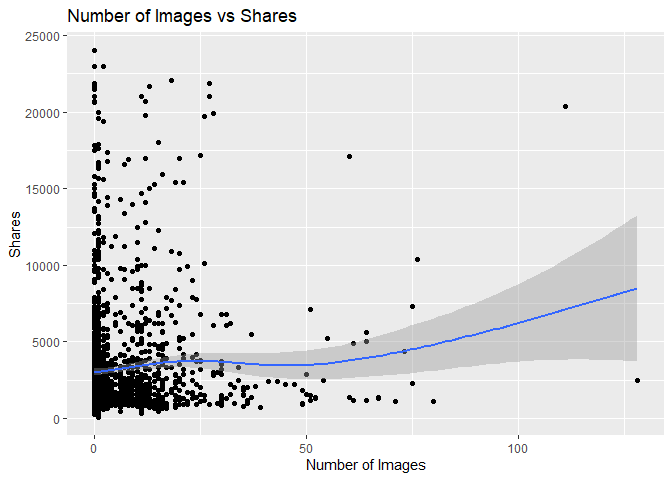
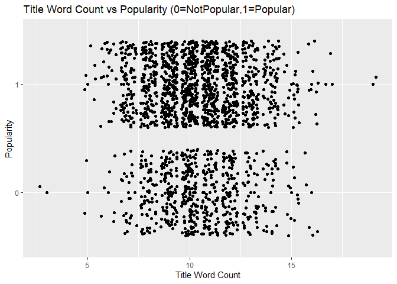
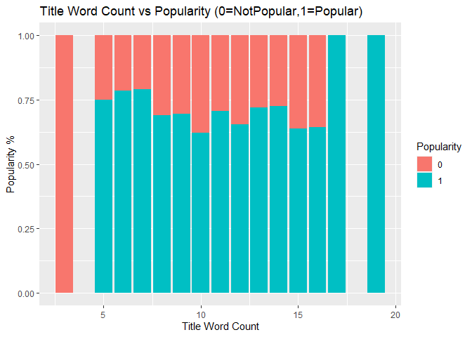

Project 2
================
Brian Sugg
7/3/2020

  - [Introduction](#introduction)
      - [Purpose](#purpose)
      - [Data Description](#data-description)
      - [Methods](#methods)
  - [Data](#data)
      - [Metadata](#metadata)
      - [Import](#import)
      - [Slicing](#slicing)
  - [Summarizations](#summarizations)
      - [Numeric Summaries](#numeric-summaries)
      - [Visuals](#visuals)
  - [Modeling](#modeling)
      - [Ensemble Model](#ensemble-model)
          - [Fit](#fit)
          - [Selection](#selection)
          - [Test Set Predictions](#test-set-predictions)
      - [Linear Regression Model](#linear-regression-model)
          - [Fit](#fit-1)
          - [Selection](#selection-1)
          - [Test Set Predictions](#test-set-predictions-1)
  - [Conclusion](#conclusion)

# Introduction

## Purpose

The overall theme of this exercise is determining the popularity of
online news. The goal is to create models for predicting the popularity
of news articles from *mashable.com* using binary classification to
categorize article shares in social networks. Two models will be
created: a linear regression model and a non-linear ensemble model. The
parameter functionality of markdown will be used to automatically
generate an analysis report for each day of the week that an article
might be published.

## Data Description

The data comes from the *UC Irvine Machine Learning Repository* and can
be found in its original form at this
[link](https://archive.ics.uci.edu/ml/datasets/Online+News+Popularity#).

This data set covers a two year period, listing all published articles
from Mashable and several variables of associated characteristics, such
as:

  - Published Day of Week
  - Channel, or Genre (Lifestyle, Business, World, Entertainment, etc.)
  - Word Count
  - Number of Images
  - *…and several others…*

In total there are **58 possible predictive attributes** with the goal
of predicting the response variable of article popularity using a binary
classification based on number of shares in social networks. The
provided link above goes into more detail for all variables and their
representation.

## Methods

The methods used in the creation of both models will follow a similar
approach. The cleansed data set for each day of the week will be split
into a training (70% of records) and a testing set (30% of records). The
training set will undergo k-fold cross validation for the model fit,
with a varying level of folds and resampling for each model type. The
fitted model will be selected automatically by the `caret` package based
on resulting accuracy, and then applied to the testing data set to
determine actual accuracy and associated misclassification rate.

The non-linear ensemble model for this exercise will be random forests,
and the linear model will be a logistic regression model under the
family of generalized linear regression. More detail around these two
model types is discussed further in their relevant sections.

The final *Conclusion* section will automatically select and display the
accuracy and misclassification rate from the best model, determined by
accuracy.

# Data

## Metadata

As mentioned previously, the original data set contains 58 possible
predictor variables and 1 response variable. We will add 1 additional
response variable for “Popularity” during the import process below in
case this is something we wish to also predict. *Popularity* will be
defined as any article that is shared at least 1,400 times.

The provided predictor variables have a wide range of characteristics
they represent. A listing of some of the primary variables to consider
in this analysis:

  - `n_tokens_title` - number of words in the title
      - Are short titles more catchy to the reader?  
  - `n_tokens_content` - number of words in the article
      - Is a shorter article more likely to be quickly digested and
        shared vs longer articles that require more time?  
  - `num_imgs` - number of images in the article
      - Are more images more visually appealing, generating shares from
        people wanting to share the images within?  
  - `num_videos` - number of videos in the article
      - Videos can provide article content more easily, but also
        requires the attention of the viewer. Could this influence
        sharing?  
  - `data_channel_is_*` - 6 binary variables that indicate if an article
    falls under the genre *Lifestyle*, *Entertainment*, *Business*,
    *Social Media*, *Tech*, or *World*
      - Does the channel/genre influence sharing?

Many other variables are present, especially in determining the
positive/negative association of words within the article and the title,
which will be discussed further if they become prevalent in our
analysis.

## Import

The raw data set from UCI is provided and read in as a `.csv` file,
creating the `news` data set. Extreme values for `shares` \> 25,000 are
filtered out (578 removed out of 39,644 records). The parameter
functionality of markdown is then incorporated from the YAML header,
initially using the parameter value `day` to filter the `news` data set
on a certain day of week for analysis.

Additional modifications are made, including the creation of a binary
`popularity` variable as mentioned earlier, defining popularity as any
article shared more than 1,400 times. To help visualize the amount of
articles per `channel`, this variable is created as well using the
`data_channel_is*` variables. Finally, any non-predictive variables are
removed to create a `newsSlice` data set that will be sliced into train
and test sets later on.

``` r
# Read in the data, filter out extreme values
news <- read_csv("data/OnlineNewsPopularity.csv")
```

    ## Parsed with column specification:
    ## cols(
    ##   .default = col_double(),
    ##   url = col_character()
    ## )

    ## See spec(...) for full column specifications.

``` r
news <- news %>% filter(shares < 25000)
# Filter data set on day of week using markdown parameter
filterDay <- paste0("weekday_is_", tolower(params$day))
news <- filter(news, eval(as.symbol(filterDay)) == 1)
# Create a binary variable for popularity
news$sharesPopular <- factor(ifelse(news$shares < 1400, 0, 1))
# Create variable for channel using the 6 individual channel variables
# if present
news$channel <- factor(ifelse(news$data_channel_is_lifestyle == 1, "Lifestyle", 
    ifelse(news$data_channel_is_entertainment == 1, "Entertainment", ifelse(news$data_channel_is_bus == 
        1, "Business", ifelse(news$data_channel_is_socmed == 1, "Social Media", 
        ifelse(news$data_channel_is_tech == 1, "Tech", ifelse(news$data_channel_is_world == 
            1, "World", "Other")))))))
# Remove 2 non-predictive variables as noted in linked documentation
# from UCI
newsSlice <- news %>% select(-url, -timedelta)
```

For verification, a preview of the `newsSlice` set is generated prior to
slicing:

``` r
head(newsSlice)
```

    ## # A tibble: 6 x 61
    ##   n_tokens_title n_tokens_content n_unique_tokens n_non_stop_words
    ##            <dbl>            <dbl>           <dbl>            <dbl>
    ## 1              8              311           0.588             1.00
    ## 2             13              889           0.462             1.00
    ## 3             10              181           0.682             1.00
    ## 4             14              335           0.616             1.00
    ## 5             12                0           0                 0   
    ## 6             10              108           0.813             1.00
    ## # ... with 57 more variables: n_non_stop_unique_tokens <dbl>, num_hrefs <dbl>,
    ## #   num_self_hrefs <dbl>, num_imgs <dbl>, num_videos <dbl>,
    ## #   average_token_length <dbl>, num_keywords <dbl>,
    ## #   data_channel_is_lifestyle <dbl>, data_channel_is_entertainment <dbl>,
    ## #   data_channel_is_bus <dbl>, data_channel_is_socmed <dbl>,
    ## #   data_channel_is_tech <dbl>, data_channel_is_world <dbl>, kw_min_min <dbl>,
    ## #   kw_max_min <dbl>, kw_avg_min <dbl>, kw_min_max <dbl>, kw_max_max <dbl>,
    ## #   kw_avg_max <dbl>, kw_min_avg <dbl>, kw_max_avg <dbl>, kw_avg_avg <dbl>,
    ## #   self_reference_min_shares <dbl>, self_reference_max_shares <dbl>,
    ## #   self_reference_avg_sharess <dbl>, weekday_is_monday <dbl>,
    ## #   weekday_is_tuesday <dbl>, weekday_is_wednesday <dbl>,
    ## #   weekday_is_thursday <dbl>, weekday_is_friday <dbl>,
    ## #   weekday_is_saturday <dbl>, weekday_is_sunday <dbl>, is_weekend <dbl>,
    ## #   LDA_00 <dbl>, LDA_01 <dbl>, LDA_02 <dbl>, LDA_03 <dbl>, LDA_04 <dbl>,
    ## #   global_subjectivity <dbl>, global_sentiment_polarity <dbl>,
    ## #   global_rate_positive_words <dbl>, global_rate_negative_words <dbl>,
    ## #   rate_positive_words <dbl>, rate_negative_words <dbl>,
    ## #   avg_positive_polarity <dbl>, min_positive_polarity <dbl>,
    ## #   max_positive_polarity <dbl>, avg_negative_polarity <dbl>,
    ## #   min_negative_polarity <dbl>, max_negative_polarity <dbl>,
    ## #   title_subjectivity <dbl>, title_sentiment_polarity <dbl>,
    ## #   abs_title_subjectivity <dbl>, abs_title_sentiment_polarity <dbl>,
    ## #   shares <dbl>, sharesPopular <fct>, channel <fct>

## Slicing

Utilizing the newly created `newsSlice` data set, a random sample is
performed for 70% of the data to make up the training set `newsTrain`,
and the remaining 30% to be used later as the test set `newsTest`. A
seed is set beforehand to ensure reproducible sampling in the future if
needed.

``` r
# Set seed for reproducible results
set.seed(1)
# Create the train and test sets
train <- sample(1:nrow(newsSlice), size = nrow(newsSlice) * 0.7)
test <- dplyr::setdiff(1:nrow(newsSlice), train)
newsTrain <- newsSlice[train, ]
newsTest <- newsSlice[test, ]
```

For the analysis of articles published on **Sunday** there are a total
of 2,694 records sliced as:

  - 1,885 records used in the `newsTrain` data set (69.97%)  
  - 809 records used in the `newsTest` data set (30.03%)

# Summarizations

Some basic summary statistics and visualizations of the `newsTrain`
training data are provided in the below sections, using variables
discussed previously.

## Numeric Summaries

A contingecy table is provided for the categorical variable `channel` to
compare against article popularity, where a popular article is defined
as having at least 1,400 shares.

``` r
# Contingency tables of frequency
knitr::kable(table(newsTrain$channel, newsTrain$sharesPopular), format = "html", 
    caption = "Frequency of Article Channel by Sharing Popularity (0=NotPopular,1=Popular)")
```

<table>

<caption>

Frequency of Article Channel by Sharing Popularity
(0=NotPopular,1=Popular)

</caption>

<thead>

<tr>

<th style="text-align:left;">

</th>

<th style="text-align:right;">

0

</th>

<th style="text-align:right;">

1

</th>

</tr>

</thead>

<tbody>

<tr>

<td style="text-align:left;">

Business

</td>

<td style="text-align:right;">

44

</td>

<td style="text-align:right;">

193

</td>

</tr>

<tr>

<td style="text-align:left;">

Entertainment

</td>

<td style="text-align:right;">

134

</td>

<td style="text-align:right;">

240

</td>

</tr>

<tr>

<td style="text-align:left;">

Lifestyle

</td>

<td style="text-align:right;">

37

</td>

<td style="text-align:right;">

106

</td>

</tr>

<tr>

<td style="text-align:left;">

Other

</td>

<td style="text-align:right;">

133

</td>

<td style="text-align:right;">

229

</td>

</tr>

<tr>

<td style="text-align:left;">

Social Media

</td>

<td style="text-align:right;">

13

</td>

<td style="text-align:right;">

80

</td>

</tr>

<tr>

<td style="text-align:left;">

Tech

</td>

<td style="text-align:right;">

45

</td>

<td style="text-align:right;">

229

</td>

</tr>

<tr>

<td style="text-align:left;">

World

</td>

<td style="text-align:right;">

186

</td>

<td style="text-align:right;">

216

</td>

</tr>

</tbody>

</table>

Numeric summaries of different article stats help reveal a few
observations from the training data set regarding the length of article
titles, the length of articles, the number of images within an article,
and the number of videos within an article.

``` r
knitr::kable(cbind(`Title Word Count` = round(summary(newsTrain$n_tokens_title), 
    1), `Article Word Count` = round(summary(newsTrain$n_tokens_content), 
    1), `Number of Images` = round(summary(newsTrain$num_imgs), 1), `Number of Videos` = round(summary(newsTrain$num_videos), 
    1)), caption = paste("Summary of Article Characteristics"))
```

|         | Title Word Count | Article Word Count | Number of Images | Number of Videos |
| ------- | ---------------: | -----------------: | ---------------: | ---------------: |
| Min.    |              3.0 |                0.0 |                0 |                0 |
| 1st Qu. |              9.0 |              249.0 |                1 |                0 |
| Median  |             10.0 |              467.0 |                1 |                0 |
| Mean    |             10.4 |              616.2 |                6 |                1 |
| 3rd Qu. |             12.0 |              825.0 |                8 |                1 |
| Max.    |             19.0 |             8474.0 |              128 |               74 |

Summary of Article Characteristics

## Visuals

A basic histogram is first explored for number of shares in the
`newsTrain` data set, which is typically skewed right.

``` r
# Histogram creation
histShares <- ggplot(data = newsTrain, aes(x = shares))
histShares + geom_histogram(bins = 30) + labs(x = "Number of Shares", y = "Article Count", 
    title = "Histogram of Shares")
```

<!-- -->

The number of shares can be better visualized in a boxplot by `channel`,
showcasing the summary stats for each.

``` r
# Boxplot creation by position
boxChannel <- ggplot(data = newsTrain)
boxChannel + geom_jitter(aes(x = channel, y = shares, color = channel)) + 
    geom_boxplot(aes(x = channel, y = shares)) + labs(x = "Article Channel", 
    y = "Shares on Social Networks", title = "Boxplot for Number of Shares per Article Channel") + 
    theme(legend.position = "none")
```

<!-- -->

``` r
# Scatter plot 1 creation
plotWordCount <- ggplot(data = newsTrain, aes(x = n_tokens_content, y = shares))
plotWordCount + geom_point() + geom_smooth(method = NULL) + labs(x = "Article Word Count", 
    y = "Shares", title = "Article Word Count vs Shares")
```

    ## `geom_smooth()` using method = 'gam' and formula 'y ~ s(x, bs = "cs")'

<!-- -->

``` r
# Scatter plot 2 creation
plotImages <- ggplot(data = newsTrain, aes(x = num_imgs, y = shares))
plotImages + geom_point() + geom_smooth(method = NULL) + labs(x = "Number of Images", 
    y = "Shares", title = "Number of Images vs Shares")
```

    ## `geom_smooth()` using method = 'gam' and formula 'y ~ s(x, bs = "cs")'

<!-- -->

``` r
# Scatter plot 3 creation
plotVideos <- ggplot(data = newsTrain, aes(x = n_tokens_content, y = shares))
plotVideos + geom_point() + geom_smooth(method = NULL) + labs(x = "Number of Videos", 
    y = "Shares", title = "Number of Videos vs Shares")
```

    ## `geom_smooth()` using method = 'gam' and formula 'y ~ s(x, bs = "cs")'

<!-- -->

``` r
# 100% Stack bar chart on popularity
stackBar <- ggplot(data = newsTrain, aes(x = n_tokens_title))
stackBar + geom_bar(aes(fill = sharesPopular), position = "fill") + labs(x = "Title Word Count", 
    y = "Popularity %", title = "Popularity (0=NotPopular,1=Popular) vs Title Word Count") + 
    scale_fill_discrete(name = "Popular Article")
```

<!-- -->

A few plots help illustrate the above numeric summaries, and offer
additional views.

The general things that the plots describe should be explained but,
since we are going to automate things, there is no need to try and
explain particular trends in the plots you see (unless you want to try
and automate that too\!).

# Modeling

Following a similar method from the original use case presented by
documentation on the UCI website, we will make our prediction challenge
into a binary classification problem by dividing the `shares` variable
into two groups to represent shares popularity, as created in the
`sharesPopular` variable earlier. If the predicted value or
`sharesPopular` is 1, then we anticipate at least 1,400 shares. Else, if
the predicted value is 0 then we anticipate less than 1,400 shares.

Two types of models will be fitted, tested, and analyzed for accuracy
and misclassification of this prediction. As mentioned previously, the
first will be an Ensemble Model via Random Forests and the second will
be a Linear Regression model via a Generalized Linear Model for Logistic
Regression. Both will test all possible predictor variables.

The fit process will utilize the `caret` package and available relevant
options for each model type, with more detail to follow. For each fit,
we will rely on the functionality of the `caret` package to assist with
k-fold cross validation, centering, and scaling.

## Ensemble Model

The approach with Random Forests includes building decision tress on
bootstrapped training samples, then relying on a random sample of *m
predictors* to be used as split candidates from the full set of provided
predictors. This random sample of a small subset of predictors helps
decorrelate the trees and prevent any strong predictors from
consistently occuring in each tree. This differentiates Random Forests
from Bagging, offering a slight improvement in prediction, which is why
this method has been chosen in this exercise.

### Fit

The fit for the Random Forests model is done here using k-fold cross
validation on the `newsTrain` data set. Since fitting for this type of
model is computationally expensive, only 5 folds have been chosen for
cross validation, repeated 3 times. A seed has also been set to ensure
reproducible results.

Since our data set has been filtered on articles published for one
specific day of the week, all `weekday_is_*` variables have been
excluded from the training. Also, the data is centered and scaled using
the `preProcess` option of the `train()` function from the `caret`
package.

``` r
# 1. Use trainControl() function to control computations and set number
# of desired folds for cross validation
trctrl <- trainControl(method = "repeatedcv", number = 2, repeats = 3)
# 2. Set a seed for reproducible results
set.seed(3333)
# 3. Use train() function to determine a random forest model of best
# fit
randFor_fit <- train(sharesPopular ~ ., data = newsTrain[, c(1:29, 38:58, 
    60)], method = "rf", trControl = trctrl, preProcess = c("center", "scale"), 
    tuneLength = 10)
```

### Selection

``` r
# Print results with accuracy for best fit
randFor_fit
```

    ## Random Forest 
    ## 
    ## 1885 samples
    ##   50 predictor
    ##    2 classes: '0', '1' 
    ## 
    ## Pre-processing: centered (50), scaled (50) 
    ## Resampling: Cross-Validated (2 fold, repeated 3 times) 
    ## Summary of sample sizes: 942, 943, 943, 942, 942, 943, ... 
    ## Resampling results across tuning parameters:
    ## 
    ##   mtry  Accuracy   Kappa    
    ##    2    0.7172395  0.1977673
    ##    7    0.7122881  0.2101156
    ##   12    0.7108738  0.2162586
    ##   18    0.7082218  0.2134752
    ##   23    0.7068081  0.2120058
    ##   28    0.7032723  0.2076583
    ##   34    0.7053936  0.2134367
    ##   39    0.7018587  0.2056296
    ##   44    0.7039785  0.2115468
    ##   50    0.7030952  0.2080334
    ## 
    ## Accuracy was used to select the optimal model using the largest value.
    ## The final value used for the model was mtry = 2.

Given our training parameters discussed above, utilizing k-fold cross
validaiton, our model selection is based on the provided training
calculations output from the `caret` package, which indicates an optimal
`MTRY` value of **2**. This model fit will be tested on `newsTest` data
set and then measured for actual accuracy and associated
misclassification rate.

### Test Set Predictions

The selected model is now applied to the `newsTest` data set, and a
confusion matrix provided to detail the resulting accuracy of our
*predictions vs the actual reference values* from the test set.

``` r
# Create predictions of class variable on the test data set using our
# model
testPredRF <- predict(randFor_fit, newdata = newsTest)
# Generate confusion matrix showing table of results with accuracy
conMatrixRF <- confusionMatrix(testPredRF, newsTest$sharesPopular)
conMatrixRF
```

    ## Confusion Matrix and Statistics
    ## 
    ##           Reference
    ## Prediction   0   1
    ##          0  48  31
    ##          1 216 514
    ##                                           
    ##                Accuracy : 0.6947          
    ##                  95% CI : (0.6617, 0.7263)
    ##     No Information Rate : 0.6737          
    ##     P-Value [Acc > NIR] : 0.1075          
    ##                                           
    ##                   Kappa : 0.1525          
    ##                                           
    ##  Mcnemar's Test P-Value : <2e-16          
    ##                                           
    ##             Sensitivity : 0.18182         
    ##             Specificity : 0.94312         
    ##          Pos Pred Value : 0.60759         
    ##          Neg Pred Value : 0.70411         
    ##              Prevalence : 0.32633         
    ##          Detection Rate : 0.05933         
    ##    Detection Prevalence : 0.09765         
    ##       Balanced Accuracy : 0.56247         
    ##                                           
    ##        'Positive' Class : 0               
    ## 

``` r
# Use values from confusion matrix to calculate misclassification rate
misclassRateRF <- 1 - sum(diag(conMatrixRF$table))/sum(conMatrixRF$table)
```

Performance metrics for the **Random Forest** model predictions on
`newsTest` with **`MTRY=`2**:  
**Accuracy:** 0.6947  
**Misclassification Rate:** 0.3053

These values will be later compared against the upcoming Linear
Regression Model to determine best performance between the two.

## Linear Regression Model

The approach for the Generalized Linear Model of Logistic Regression was
chosen given the non-continuous, binary nature of our outcome of
predicting either a 0 or 1 for popularity. The same set of possible
predictors will be provided.

### Fit

The fit for the logistic regression model is done here again using
k-fold cross validation on the `newsTrain` data set. Since less
computation is required, we have increased our training to 10 folds,
with resampling repeated 5 times. The `family="binomial"` argument has
been provided to the `glm` method to explicitly state the desired fit of
logistic regression, although the `caret` package should recognize this
as the optimal approach even without the argument.

As before, all `weekday_is_*` variables have been excluded from the
training since the data set is filtered on just one published day of the
week. The training data is still centered and scaled using the
`preProcess` option of the `train()` function from the `caret` package.

``` r
# 1. Use trainControl() function to control computations and set number
# of desired folds for cross validation
trctrl <- trainControl(method = "repeatedcv", number = 10, repeats = 5)
# 2. Set a seed for reproducible result
set.seed(3333)
# 3. Use train() function to determine a generalized linear regression
# model of best fit
logReg_fit <- train(sharesPopular ~ ., data = newsTrain[, c(1:29, 38:58, 
    60)], method = "glm", family = "binomial", trControl = trctrl, preProcess = c("center", 
    "scale"), tuneLength = 10)
```

### Selection

``` r
# Print results with accuracy for best fit
logReg_fit
```

    ## Generalized Linear Model 
    ## 
    ## 1885 samples
    ##   50 predictor
    ##    2 classes: '0', '1' 
    ## 
    ## Pre-processing: centered (50), scaled (50) 
    ## Resampling: Cross-Validated (10 fold, repeated 5 times) 
    ## Summary of sample sizes: 1696, 1697, 1696, 1697, 1696, 1697, ... 
    ## Resampling results:
    ## 
    ##   Accuracy   Kappa    
    ##   0.7000491  0.2102591

Given our training parameters discussed above, utilizing k-fold cross
validaiton, our model selection is based on the provided training
calculations output from the `caret` package. This model fit will be
tested on `newsTest` data set and then measured for actual accuracy and
associated misclassification rate.

### Test Set Predictions

The selected model is now applied to the `newsTest` data set, and a
confusion matrix provided to detail the resulting accuracy of our
*predictions vs the actual reference values* from the test set.

``` r
# Create predictions of class variable on the test data set using our
# model
testPredGLM <- predict(logReg_fit, newdata = newsTest)
# Generate confusion matrix showing table of results with accuracy
conMatrixGLM <- confusionMatrix(testPredGLM, newsTest$sharesPopular)
conMatrixGLM
```

    ## Confusion Matrix and Statistics
    ## 
    ##           Reference
    ## Prediction   0   1
    ##          0  75  68
    ##          1 189 477
    ##                                          
    ##                Accuracy : 0.6823         
    ##                  95% CI : (0.649, 0.7143)
    ##     No Information Rate : 0.6737         
    ##     P-Value [Acc > NIR] : 0.3142         
    ##                                          
    ##                   Kappa : 0.1807         
    ##                                          
    ##  Mcnemar's Test P-Value : 7.133e-14      
    ##                                          
    ##             Sensitivity : 0.28409        
    ##             Specificity : 0.87523        
    ##          Pos Pred Value : 0.52448        
    ##          Neg Pred Value : 0.71622        
    ##              Prevalence : 0.32633        
    ##          Detection Rate : 0.09271        
    ##    Detection Prevalence : 0.17676        
    ##       Balanced Accuracy : 0.57966        
    ##                                          
    ##        'Positive' Class : 0              
    ## 

``` r
# Use values from confusion matrix to calculate misclassification rate
misclassRateGLM <- 1 - sum(diag(conMatrixGLM$table))/sum(conMatrixGLM$table)
```

Performance metrics for the **Generalized Linear Regression** model
predictions on `newsTest`:  
**Accuracy:** 0.6823  
**Misclassification Rate:** 0.3177

These values will be compared in the upcoming *Conclusion* section to
determine the best performance between the two models.

# Conclusion

To briefly recap the performance metrics of accuracy and
misclassifications rates for both models:

**Random Forest** model predictions on `newsTest` with **`MTRY=`2**:  
**Accuracy:** 0.6947  
**Misclassification Rate:** 0.3053

**Generalized Linear Regression** model predictions on `newsTest`:  
**Accuracy:** 0.6823  
**Misclassification Rate:** 0.3177

This shows the best method for predicting the popularity of articles
published on a **Sunday** is done using **the Ensemble Model with Random
Forests**. This is based on having a higher **accuracy value of 0.6947**
with an associated **misclassification rate of 0.3053**.
